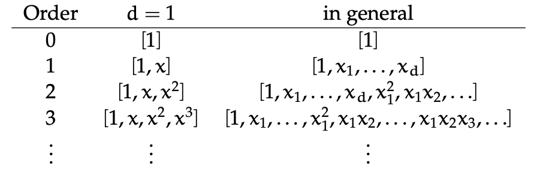

# Feature Representation 

We need to transform data in order to start the ML implementation since it is hard to learn anything from the raw data.

$\phi$ : $R^d$ --> $R^D$, usually D > d 

## 1) Specific Feature Transformation : 

Only if we have a ***linearly separable Dn***
We want to go from a separator that is ***NOT*** through the origin to one that ***IS*** through the origin

Original separator (not through origin) : $h(x;\theta,\theta_0) = sign(\theta^{T}*x + \theta_0)$ 

Let $\theta = [\theta_1, ..., \theta_d]$, $\theta_0 \in R$, x $\in R^d$

$\phi$([x_1, ... , x_d]) = [x_1, ... ,x_d, **1**] $\in R^{d+1}$

$\theta_{new} = [\theta_1, ..., \theta_d$, **$\theta_0$**]

So we added $\theta_0$ to $\theta$ and **$h(x;\theta_{new})$** is a **seprator through the origin**.

$h(x;\theta_{new}) = sign(\theta_{new}^{T}*x_{new}) = sign(\theta^{T}*x + \theta_0)$ 

***NOTE :*** If you have a separator not through the origin in **d**-dimensions, you can get a separator through the origin in **d+1**-dimensions.

### Examples : 

## Polynomial Features :

One systematic way of generating non-linear transformations of your input features is to consider the polynomials of increasing order. Given a feature vector 
$x =[x_1,x_2,...,x_d]^T$, we can map it into a new feature vector that contains all the factors in a polynomial of order d. 

For example, for $x=[x_1,x_2]^T$ and order 2, we get :

$\phi(x) = [1,x_1,x_2,x_1*x_2,x_1^2,x_2^2,x_1^2x_2,x_1x_2^2,x_1^3,x_2^3]$

**NOTE :** The more we add dimensions the more we can run into overfitting !

If the features in your problem are already naturally numerical, one systematic strategy for constructing a new feature space is to use a polynomial basis. The idea is that, if you are
using the kth-order basis (where kis a positive integer), you include a feature for every possible product of kdifferent dimensions in your original input.
Here is a table illustrating the kth order polynomial basis for different values of k.

## Discrete Features :

Getting a good encoding of discrete features is particularly important. You want to create “opportunities” for the ML system to find the underlying regularities. So, we
have to figure out some reasonable strategies for turning discrete values into (vectors of) real numbers. Some encoding startegies include :

**1) Numeric** Assign each of the values a number. This is a sensible strategy **only** when the discrete values really do signify some sort of numeric quantity.

**2) Thermometer Code** If the discrete values have a natural ordering (from 1,...,k) but not a natural mapping into real numbers, a good strategy is to use a vector of length k binary variables,
where we convert discrete input value $0 < j \leq k$ into a vector in which the first j values are 1.0 and the rest are 0.0. This does not necessarily imply anything about the spacing or numerical quantities of the input, but does convey something about ordering.

**3) Factored Code** If the discrete valyues can be sensibly decomposed into 2 parts, then it's best to treat those as 2 separate features, and choose an appropriate encoding for each one.

**4) One-hot Encoding** If there is no obvious numeric, ordering, or factorial strucutre, then the best strategy is to use a vector of length k, where we convert discrete input values 
$0 < j \leq k$ into a vector in which all values are 0.0 except for the $j^{th}$, which is 1.0

**5) Binary Code** BAD IDEA ! Decoding binary code takes a lot of work, and by encoding the input this way you will be forcing the system to learn the decoding algorithm!

Example : Factored Code :
We have 4 blood types : AB+, AB-, A-, A+, B+, B-, O+, O-
There is no obvious linear numeric scaling or even ordering to this set. But there is a reasonable *factoring* into 2 features :
[AB,A,B,O] and [+,-] which can then be factored more into [A, notA],[B,notB],[+,-]. 

## Numeric Values :

Usually we have to ***standardize numerical features*** to get them in the range [-1,+1]. Without performing this transformation, if you have one feature with much larger values than another,
it will take the learning algorithm a lot of work to find parameters that can put them on an equal basis. So we perform the transformation :

%20=%20\frac{x%20-%20\bar{x}}{\sigma})

where  is the average of the $x^{(i)}$ and $\sigma$ is the standard deviation of the $x^{(i)}$.
The resulting feature values will have mean 0 and standard deviation 1. This transformation is sometimes called ***standardizing a variable*** . 
