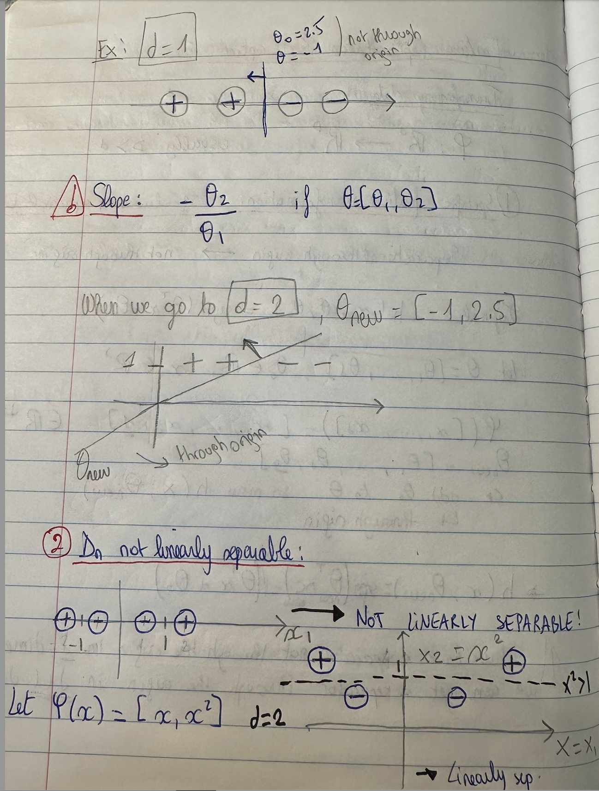

# Feature Representation 

We need to transform data in order to start the ML implementation since it is hard to learn anything from the raw data.

$\phi$ : $R^d$ --> $R^D$, usually D > d 

## 1) Specific Feature Transformation : 

Only if we have a ***linearly separable Dn***
We want to go from a separator that is ***NOT*** through the origin to one that ***IS*** through the origin

Original separator (not through origin) : $h(x;\theta,\theta_0) = sign(\theta^{T}*x + \theta_0)$ 

Let $\theta = [\theta_1, ..., \theta_d]$, $\theta_0 \in R$, x $\in R^d$

$\phi$([x_1, ... , x_d]) = [x_1, ... ,x_d, **1**] $\in R^{d+1}$

$\theta_{new} = [\theta_1, ..., \theta_d$, **$\theta_0$**]

So we added $\theta_0$ to $\theta$ and **$h(x;\theta_{new})$** is a **seprator through the origin**.

$h(x;\theta_{new}) = sign(\theta_{new}^{T}*x_{new}) = sign(\theta^{T}*x + \theta_0)$ 

***NOTE :*** If you have a separator not through the origin in **d**-dimensions, you can get a separator through the origin in **d+1**-dimensions.

### Examples : 

