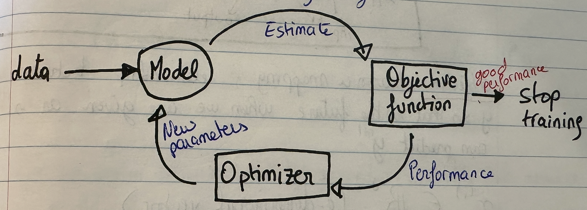

# INTRODUCTION TO MACHINE LEARNING

Main Focus of ML : 
- making decisions/predictions based on data
- fit models as a means to the end of making good decisions/predictions

Humans still have to **frame** the problem :
- Acquire and organize data --> **not always easy**
- Design the space of possible solutions
- Select the Learning Algorithm (LA) and parameters
- Apply it to the data
- Validate

***Why does previoulsy seen data help us predict the future?***
Assumptions : all training data are IID (independent and identically distributed) and queries are drawn from the same distribution as training data

We want the ML model to **learn implicit patterns** in the data to predict new data labels.
For this we need to solve two problems :

***1) Estimation :***
We usualy hav noisy data reflecting some underlying quantity of interest. When making estimates we need to take into account :
- How to deal with the fact that the same treatment may give different results on different trials ?
- How to predict how well an estimate may compare to future results ?

***2) Generalization :***
Predict results of a situation/experiment never encountered before in the dataset.

## Problem Characterization 

**1) Problem Class :**
What is the nature of the training data ? What quieries wil be made at testing ? This varies depending on what kind of data is provided and what kind of conclusions are to be drawn from it.

**2) Assumptions :**
What do we knnow about the source of the data, form of solutions?

**3) Evaluation Criteria :**
What is the goal of the prediction/estimation ? How to evaluate them ? How to measure overall performance of the system ?

**4) Model Type :** 
Will an intermediate model be made ? What aspects of the data will be modeled ? How will the model be used to make predictions ?

**5) Model Class :**
What is the model ? What are the parameters ? Criterion to pick the best model ?

**6) Algorithm :**
Computational process to fit model to data and/or make predictions ?

## Machine Learning (ML)

ML is a subset of Artificial Intelligence (AI) concerned with using specialized algorithms to uncover meaningful information and find hidden patterns from perceived data to corroborate the rational decision making process.
The model is the core component of ML and can be built in many ways. Rather than being edited by people so they work well, ML models are **shaped by data**.

Select initial guess for parameters values. the nadjust them during automated learning process --> **TRAINING**
Models don't train themselves, they are trained using data + objective function + optimizer.

**Objective Function :** What we want the model to be able to do. For a computer to understand thism we need to provide an "objective function" code also known as **Coest Function**. This will judge whether the model is good or bad.

**Optimizer :** During training, the model will make a prediction. The objective function calculates how well it performed, the optimizer then changes the model's parameters to enhance it.

**NOTE : The data, objective function and optimizer are only needed to train the data.**

### Training vs. Using a model 

**USING** a model is providing inputs and receiving and estimation/predicion as an output. This takes less than a few seconds.

**TRAINING** a model is the process of improving how well a model works. It requires to use the model, objective function and optimizer in specific order. This can take days to complete. The model is only trained once and then we can use it as many times as we want without making any changes.

When we use the model we only need **features** as input data. When we train the model we also need **labels** that show what the correct answer is.
