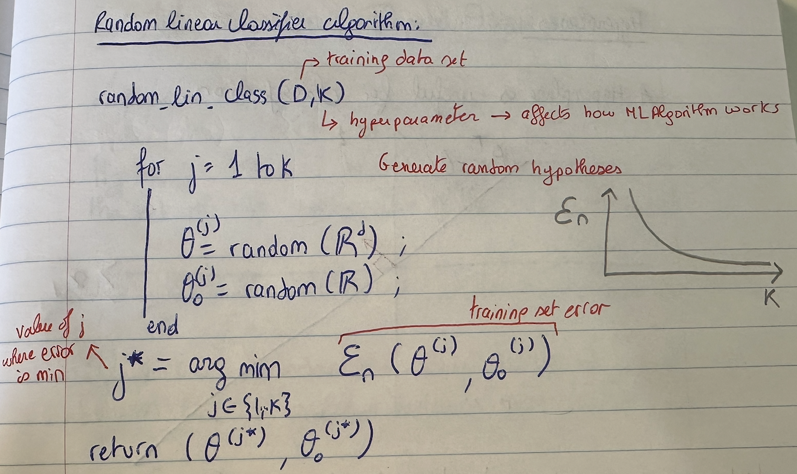

# SUPERVISED LEARNING

System is given a dataset (input) and told which specific output is associated with them.
Inputs are organized into a set of pairs :

$$
D_n = {(x_i, y_i), ... , (x_n,y_n)}
$$

Objective : learn a mapping/relationship between x and y so that in the future, when we are given $x_{n+1}$ we can predict $y_{n+1}$ .

$x_i \in \mathbb{R}^d$

$y_i$ : 
- Discrete set of values (>2) --> **Multiclass Classification**
- 2 discrete values (e.g {-1,1}) --> **Binary Classification**
- $y_i \in \mathbb{R}^k$ (k-dimensional vector) --> **Regression**

We also need to do some work on the input data : feature representation.

## Hypothesis Class

This is the set of all possible classifiers h with parameter $\theta$, where 

$$
y = h(x; \theta)
$$

## Evaluation Criteria 

Once we have specified the problem class/hypothesis class, we need to say what makes an output good, given the training data. We specify evalutation criteria at two levels : how an individual prediction is scored
and how the overall behavior of the prediction/estimation is scored. The quality of predictions from a learned model is often expressed in terms of a **loss function**. 

A **Loss Function L(g,a)** tells you how much you will be penalized for making a ***guess g*** when the ***actual answer*** is ***a***. There are many possible loss functions.
what we like : small loss on new data. So we start with trying to get a hypothesis that gives us small loss on training data.

**Training set Error :** 

$$
E_n(h) = \frac{1}{n} \sum_{i=1}^{n} L(h(x_i),y_i)
$$

**NOTE:** $h(x_i) \neq y_i$

**Testing set Error :**

$$
E(h) = \frac{1}{n^{'}} \sum_{i=n+1}^{n+n^{'}} L(h(x_i),y_i)
$$

**Evaluation of prediction function**
- Minimize loss over all predictions (risk)
- Minimize maximum loss : loss of worst prediction
- Minimize/bound regret : how much worse this predictor performs than the best one
- Characterize asymptotic behavior : how well the predictor will perform in the limirt of infinite training data

$$
y = h(x;\theta)
$$

Find $\theta$ that minimizes :

$$
E_n(\theta) = \frac{1}{n} \sum_{i=1}^{n} L(h(x_i;\theta),y_i)
$$

## Linear Classifier

$$
h(x; \theta, \theta_0) = sign(\theta^T x + \theta_0) = 
\begin{cases}
+1 & \text{if } \theta^T x + \theta_0 > 0 \\
-1 & \text{otherwise}
\end{cases}
$$

$\theta \in \mathbb{R}^d$,
$\theta_0 \in \mathbb{R}$

$\theta$ and $\theta_0$ specify a hyperplane.

## Hyperplanes

**1) Hyperplane through Origin :**

Any vector $\theta \in \mathbb{R}^d$ can define a hyperplane. Hyperplane through origin associated with $\theta$ is the set of all vectors $x \in \mathbb{R}^d$ such that
$\theta^{T} x = 0$

The **normal vecrtor** to a hyperplane is given by $\theta^{T} x = 0$. Here $\theta$ is the normal vector.

To get a **Unit Vector normal** to a hyperplane in $\mathbb{R}^d$ , we normalize $\theta$

$$
u = \frac{\theta}{||\theta||}
$$

**2) General Hyperplane, distance to origin :**

Consider hyperplanes defined by $\theta^{T} x + \theta_0 = 0$ . Define the **positive side** of a hyperplane to be the half space defined by 
$x | \theta^{T} x + \theta_0 > 0$

***Distance from hyperplane to origin*** should be :
- =0 if on the hyperplane
-  \>0 if origin is on positive side of hyperplane
-  <0 if origin is on negative side of hyperplane

**Signed Distance from a point x to hyperplane :**

$$
\frac{\theta^{T} x_0 + \theta_0}{||\theta||}
$$

**Signed Distance from origin to hyperplane :**

$$
\frac{\theta_0}{||\theta||}
$$
