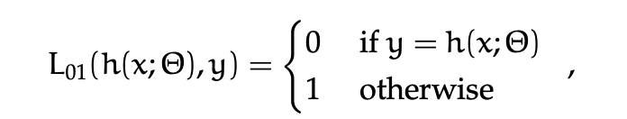
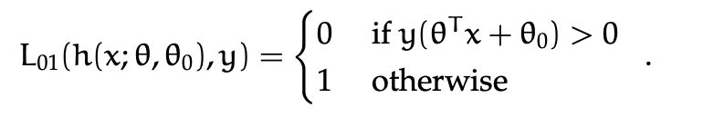

# Logistic Regression

The way we are thinking here is turning the ML problem into and optimization problem.

## Machine Learning as Optimization

Usually for optimization, we write down an **objective function** J() where  stands 
for all parameters in our model. So for **linear classifiers** we will have J($\theta,\theta_0$).

**GOAL** : want to find some parameters of a hypothesis that optimize the objective function.
The objective function describes how we feel about possible hypothesis . 
We will generally look for values for parameters that **minimize the 
objective function**

A very common form for a ML objective function is :

The Loss tells us how unhappy we are about the prediction $h(x^{(i)};\theta}$ that $\theta$ makes for $(x^{(i)},y^{(i)})$.

A common example is the ***0-1 Loss*** :

For linear separators, this becomes :

