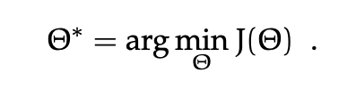
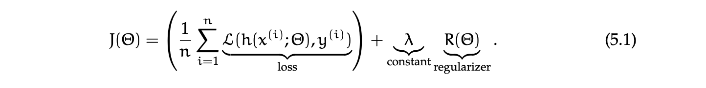
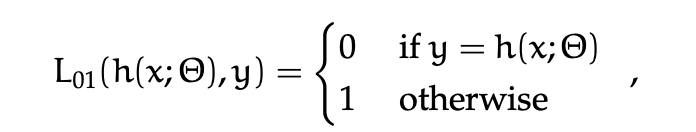
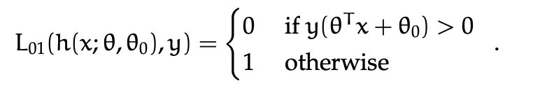
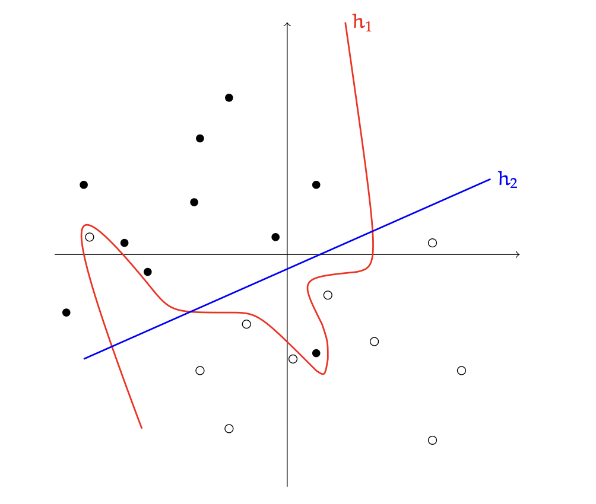

# Logistic Regression

The way we are thinking here is turning the ML problem into and optimization problem.

## Machine Learning as Optimization

Usually for optimization, we write down an **objective function** J() where  stands 
for all parameters in our model. So for **linear classifiers** we will have J($\theta,\theta_0$).

**GOAL** : want to find some parameters of a hypothesis that optimize the objective function.
The objective function describes how we feel about possible hypothesis . 
We will generally look for values for parameters that **minimize the 
objective function**

A very common form for a ML objective function is :

The Loss tells us how unhappy we are about the prediction $h(x^{(i)};\theta)$ that $\theta$ makes for $(x^{(i)},y^{(i)})$.

A common example is the ***0-1 Loss*** :

For linear separators, this becomes :

## Regularization

Ultimate goal : perform well on input data that we haven't trained on !!! --> **GENERALIZATION**

What allows generalization is a belief that there is an *underlying regularity* that governs both training and testing data. A way to describe an assumption about such a regularity is by choosing a limited class of possible hypothesis. Another way to provide smoother guidance is to say that within a hypothesis class, we prefer some hypotheses to others.

The **Regularizer** articulates this preference and the constant **$\lambda$** says how much we are willing to trade off loss on training dara vs. preference over hypotheses.

This trade-off is illustrated in the figure below. Hypothesis h1 has 0 training loss, but is very complicated. Hypothesis h2 misclassifies two points, but is very simple. 
In absence of other beliefs about the solution, it is often better to prefer that the solution be “simpler”, and so we might prefer h2 over h1, expecting it to perform better on future examples drawn from this same distribution. 

Another nice way of thinking about regularization is that we would like to ***prevent our hypothesis from being too dependent on the particular training data*** that we were given: we would like for it to be the case that if the training data were changed slightly, the hypothesis would not change by much.

A common strategy to specify a regularizer is to use the form :

$R(\theta) = ||\theta - \theta_{prior}||^2$

when we have some idea in advance that $\theta$ ought to be near some value $\theta_{prior}$. In the absence of such knowledge, a default is to *regularize toward zero* :

$R(\theta) = \|\|\theta\|\|^2$

## Linear Logistic Classifiers == Logistic Regression

