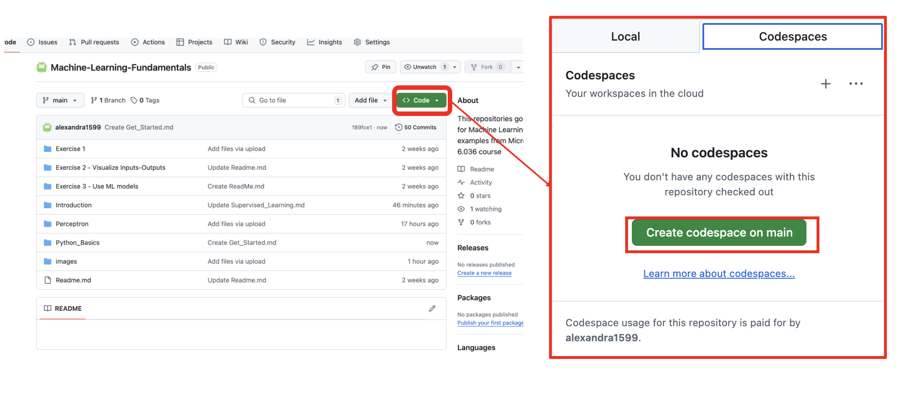
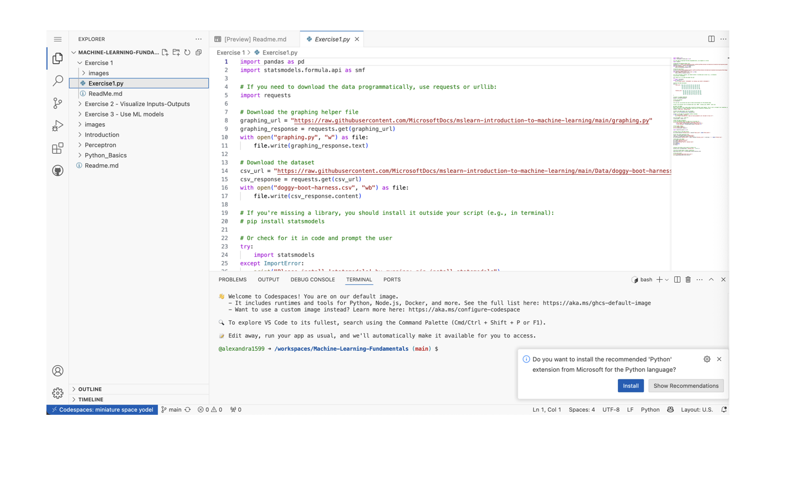
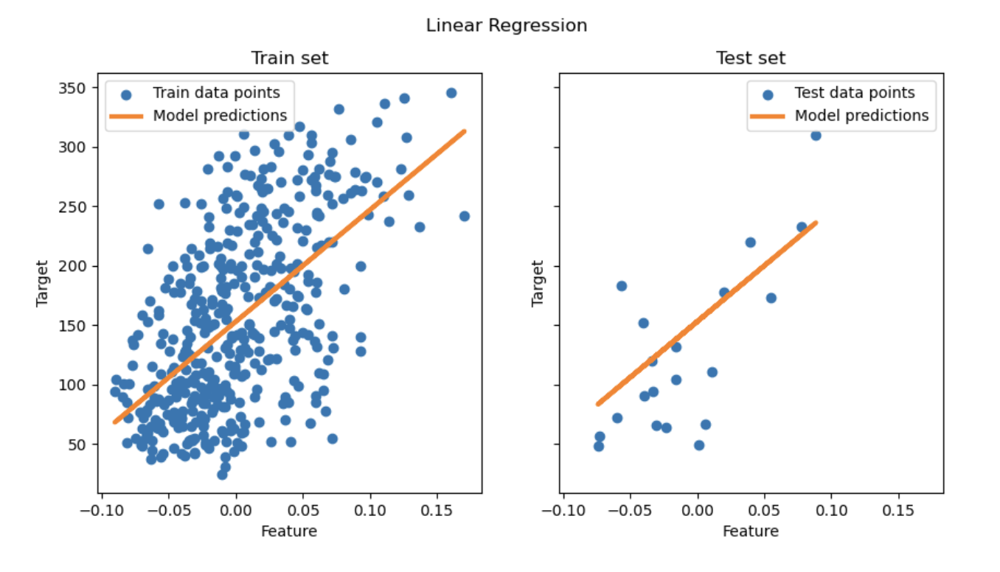

# Get started with Python and Scikit-learn 

If you find a code on github and you want to run it but you don't have python on your machine, do the following :

**1) Use Github Codespace :**

GitHub Codespaces is a cloud-based development environment that allows you to write, run, and debug code directly from your GitHub repository. It's fully integrated with GitHub, making it a powerful tool for collaboration, especially for open-source projects or teams. Codespaces provides a complete, customizable development environment that can be accessed from any browser or via Visual Studio Code (VS Code).

- Create a Github account
- Go to the repository you want to work on. You can either create a new repository or use an existing one.
- Create a Codespace : look for the Code button on your repository page. Click the Code button, and you will see an option to Open with Codespaces. Click New codespace.



This will launch a cloud development environment with all the files from your GitHub repository automatically loaded. Once the codespace is created, you’ll be taken to the browser-based IDE (Integrated Development Environment) that looks similar to VS Code.

Here’s an overview of the interface:

***File Explorer :*** On the left side, you'll see your files. You can navigate your project’s folder structure and open files by clicking them.

***Editor :*** In the center is the editor area where you can write and modify your code. You can open multiple files in tabs.

***Terminal :*** At the bottom, there’s an integrated terminal (similar to a command-line interface) where you can run commands (e.g., install dependencies, run your project, etc.).

***Extensions :*** GitHub Codespaces supports VS Code extensions, so you can install extensions for linting, debugging, formatting, etc.as shown below



**2) Python :**

Python is the most famous tool used in ML. Download Python3 on your machine (Mac, Windows, Linux). Also download Visual Studio Code (free code editor) where you can run python codes and jupyter notebooks. Jupyter notebooks are good because you can debug easily, see the outputs directly and step by step.

Install Visual Studio Code. Make sure you have Visual Studio Code installed on your computer. Follow these instructions to install [Visual Studio Code](https://code.visualstudio.com/) for the basic installation . You are going to use Python in Visual Studio Code in this course, so you might want to brush up on how to [configure Visual Studio Code](https://docs.microsoft.com/learn/modules/python-install-vscode?WT.mc_id=academic-77952-leestott) for Python development.

**3) Scikit-learn :**

[Scikit-learn](https://scikit-learn.org/stable/getting_started.html) is an open source machine learning library that supports supervised and unsupervised learning. It also provides various tools for model fitting, data preprocessing, model selection and evaluation, and many other utilities.
Scikit-learn makes it straightforward to build models and evaluate them for use. It is primarily focused on using numeric data and contains several ready-made datasets for use as learning tools. It also includes pre-built models for students to try. 
To import the Scikit-learn library in your code, use ***import sklearn***.

You can use the [API](https://scikit-learn.org/stable/api/index.html) to build ML models. Scikit-learn makes it straightforward to build models and evaluate them for use. It is primarily focused on using numeric data and contains several ready-made datasets for use as learning tools.

***EXAMPLE : ordinary least squares (OLS) with Linear Regression :***

Imagine that you wanted to test a treatment for diabetic patients. Machine Learning models might help you determine which patients would respond better to the treatment, based on combinations of variables. Even a very basic regression model, when visualized, might show information about variables that would help you organize your theoretical clinical trials.

There are many types of regression methods, and which one you pick depends on the answer you're looking for. If you want to predict the probable height for a person of a given age, you'd use ***linear regression***, as you're seeking a ***numeric value***. If you're interested in discovering whether a type of cuisine should be considered vegan or not, you're looking for a ***category assignment*** so you would use ***logistic regression***.

Use a single feature (for simplicity) from the diabetes dataset and try to predict the diabetes progression using this linear model. 
STEP 1 : Load dataset and split into train and test sets

```
from sklearn.datasets import load_diabetes
from sklearn.model_selection import train_test_split

X, y = load_diabetes(return_X_y=True)
X = X[:, [2]]  # Use only one feature
X_train, X_test, y_train, y_test = train_test_split(X, y, test_size=20, shuffle=False)
```
STEP 2 : Create a linear regression model and fit it on the training data. Note that by default, an intercept is added to the model. We can control this behavior by setting the fit_intercept parameter.

```
from sklearn.linear_model import LinearRegression

regressor = LinearRegression().fit(X_train, y_train)
```
STEP 3 : Evaluate the model’s performance on the test set using the mean squared error and the coefficient of determination.

```
from sklearn.metrics import mean_squared_error, r2_score

y_pred = regressor.predict(X_test)

print(f"Mean squared error: {mean_squared_error(y_test, y_pred):.2f}")
print(f"Coefficient of determination: {r2_score(y_test, y_pred):.2f}")
```
Your ouput should be :
Mean squared error: 2548.07
Coefficient of determination: 0.47

STEP 4 : Visualize the results 

```
import matplotlib.pyplot as plt

fig, ax = plt.subplots(ncols=2, figsize=(10, 5), sharex=True, sharey=True)

ax[0].scatter(X_train, y_train, label="Train data points")
ax[0].plot(
    X_train,
    regressor.predict(X_train),
    linewidth=3,
    color="tab:orange",
    label="Model predictions",
)
ax[0].set(xlabel="Feature", ylabel="Target", title="Train set")
ax[0].legend()

ax[1].scatter(X_test, y_test, label="Test data points")
ax[1].plot(X_test, y_pred, linewidth=3, color="tab:orange", label="Model predictions")
ax[1].set(xlabel="Feature", ylabel="Target", title="Test set")
ax[1].legend()

fig.suptitle("Linear Regression")

plt.show()
```



The trained model corresponds to the estimator that minimizes the mean squared error between the predicted and the true target values on the training data. We therefore obtain an estimator of the conditional mean of the target given the data.

Note that in higher dimensions, minimizing only the squared error might lead to overfitting. Therefore, regularization techniques are commonly used to prevent this issue, such as those implemented in Ridge or Lasso.
