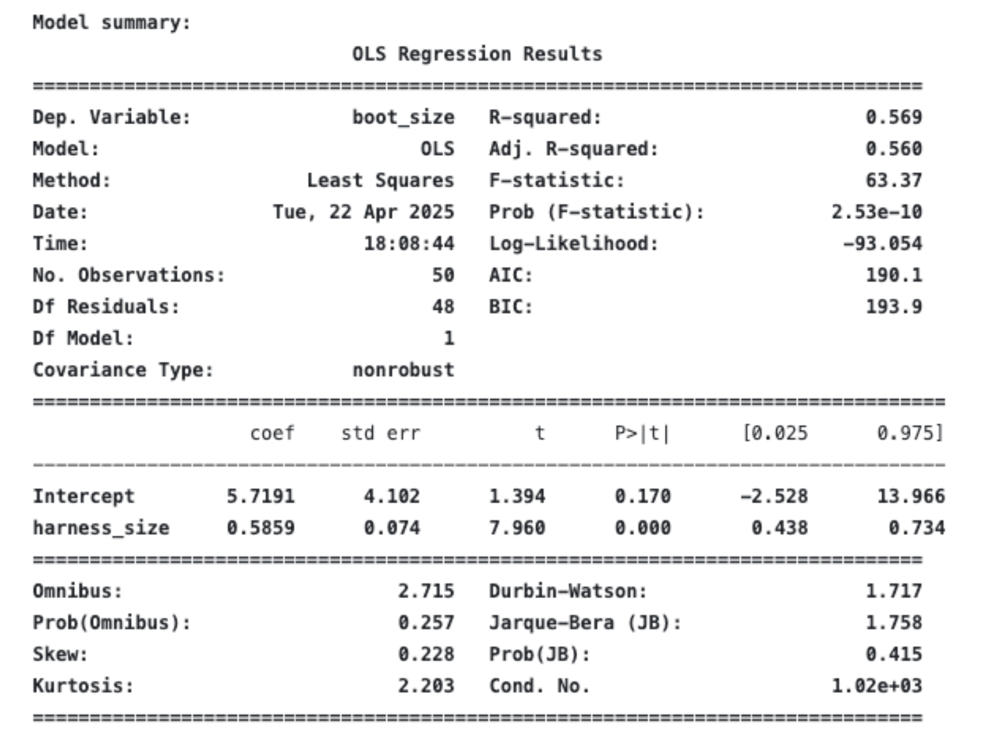
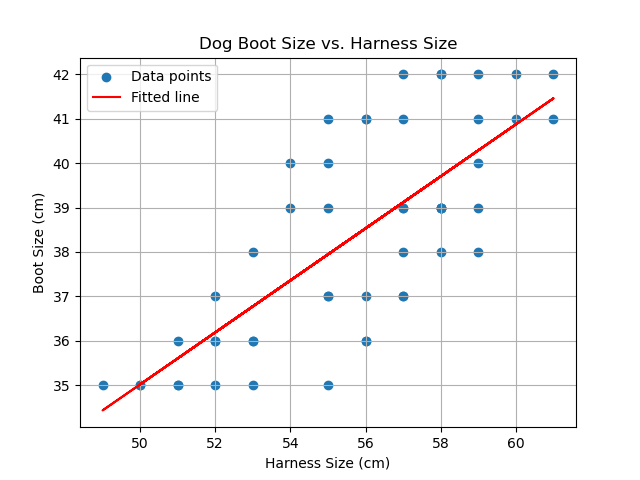

# Explanation Of Exercise 1

This exercise is to introduce how to create and train a model. In this exercise, we are creating a model that takes in dog harness size as input and should output their corresponding boot size.

## STEP 1 : DOWNLOAD DATA

The first step is to download the dataset, and define a dictionary. Here, we will have the sizes of boots and harness size of 50 avalanche dogs. 

## STEP 2 : BUILD THE MODEL 

We will use a very simple model called ***Ordinary Least Square (OLS)***.
It's one of the most fundamental models in Machine Learning and statistics — specifically in the context of linear regression.

### 🔍 What is OLS?
OLS is a method used to estimate the parameters (coefficients) of a linear regression model. The idea is simple:

Fit a straight line through your data that minimizes the sum of the squared differences between the observed values and the predicted values.

These differences are called residuals, and OLS tries to make them as small as possible—hence, least squares.

### 📈 The Linear Regression Model
In simple linear regression:

  y = β₀ + β₁x + ε

- y is the target variable (what you're trying to predict)
- x is the feature/input variable
- β₀ is the intercept
- β₁ is the slope (coefficient) for x
- ε is the error term (difference between the predicted and actual y)

OLS finds the values of β₀ and β₁ that minimize the squared errors:

∑(yᵢ - (β₀ + β₁xᵢ))²

### 🧠 Why is OLS important?

- It’s the foundation of many predictive models.
- It’s interpretable: You can understand the impact of each variable.
- It’s fast and efficient for small to medium datasets.
- It’s a great baseline model in any regression task.

## STEP 3 : FIT THE MODEL 

In this step we are going to train the model. OLS models have two parameters (a slope and an offset), but these haven't been set in our model yet. 
We need to train (fit) our model to find these values so that the model can reliably estimate dogs' boot size based on their harness size.
Notice how training the model set its parameters.

You should get the following : 

Line slope: 0.5859254167382709
Line Intercept: 5.719109812682601

Now we can also see it by plotting. The following graph shows the original data as circles with a red line through it. The red line shows our model.
We can look at this line to understand our model. For example, we can see that as harness size increases, so does the estimated boot size.

